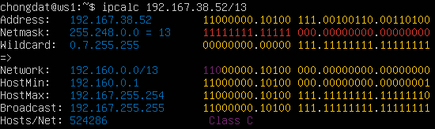
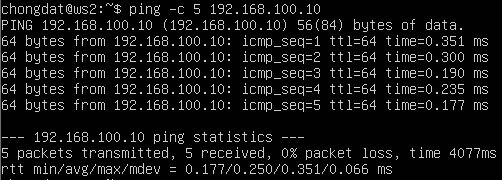
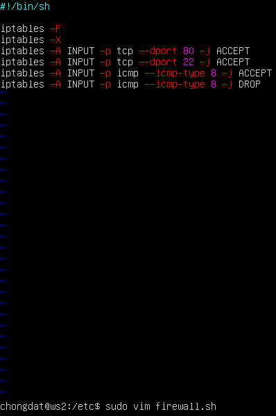
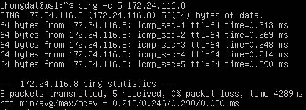
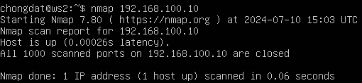
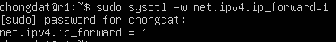
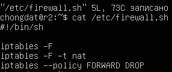
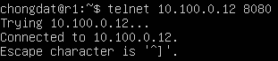

## Part 1. Инструмент **ipcalc**

#### 1.1. Сети и маски
- Устанавливаем ipcalc с помощью команды `sudo apt install ipcalc`

- Адрес сети _192.167.38.54/13_
	
	
	
- Перевод маски _255.255.255.0_ в перфиксную и двичную записи:
	
	
	
	префиксная `/24`, двоичная `11111111.11111111.11111111. 00000000`

- _/15_ в обычную и двоичную:
	
	
	
	обычная `255.254.0.0`, двоичная `11111111.11111110.00000000. 00000000`
	
- `11111111.11111111.11111111.11110000` в обычную и префиксную:
	
	Так как ipcalc версии 0.45 не поддерживает перевод из двоичной системы в обычную, посчитаем единицы в двоичной записи, чтобы узнать префексную, вручную, получается 28 единиц:
	
	
	
	Обычная `255.255.255.240`, префиксная `/28`
- Минимальный и максимальный хост в сети _12.167.38.4_ при масках: _/8_, _11111111.11111111.00000000.00000000_, _255.255.254.0_ и _/4_:
	
- При маске `/8` 

	
	
	HostMin `12.0.0.1`

	HostMax: `12.255.255.254`
	
- При маске `11111111.11111111.00000000.00000000` также считаем количество единиц.
	
	
	
	HostMin:   `12.167.0.1`

	HostMax:   `12.167.255.254`
	
- При маске `255.255.254.0`:
	
	
	
	HostMin:   `12.167.38.1`

	HostMax:   `12.167.39.254`
- При маске `/4`:
	
	
	
	HostMin:   `0.0.0.1`

	HostMax:   `15.255.255.254`

#### 1.2. localhost

- Определи и запиши в отчёт, можно ли обратиться к приложению, работающему на localhost, со следующими IP: `194.34.23.100`, `127.0.0.2`, `127.1.0.1`, `128.0.0.1`

Адреса в промежутке `127.0.0.0 — 127.255.255.255` зарезервированы системой под localhost. Также можно узнать это через ipcalc, в адресах, к которым можно обращаться, после _Class_ есть подпись _Loopback_, например:

Таким образом получается:

- 194.34.23.100 использовать нельзя
- 127.0.0.2 использовать можно
- 127.1.0.1 использовать можно
- 128.0.0.1 использовать нельзя

#### 1.3. Диапазоны и сегменты сетей
1. Какие из перечисленных IP можно использовать в качестве публичного, а какие только в качестве частных: `10.0.0.45`, `134.43.0.2`, `192.168.4.2`, `172.20.250.4`, `172.0.2.1`, `192.172.0.1`, `172.68.0.2`, `172.16.255.255`, `10.10.10.10`, `192.169.168.1`

Было принято сделать частными адрессами следующие адресса:

- _10.0.0.0_ — _10.255.255.255_ (_10.0.0.0/8_),
- _172.16.0.0_ — _172.31.255.255_ (_172.16.0.0/12_),
- _192.168.0.0_ — _192.168.255.255_ (_192.168.0.0/16_).

Еще проверить является адрес частным можно с помощью ipcalc, у таких адресов после поля _Class_ имеется подпись _Private Internet_:

Также частными адресами являются адреса, зарезервированные под localhost:
- _127.0.0.0_ — _127.255.255.255_

	Соответственно:

- Публичные: `134.43.0.2`, `172.0.2.1`, `192.172.0.1`, `172.68.0.2`, `192.169.168.1`
	
- Частные: `10.0.0.45`, `192.168.4.2`, `172.20.250.4`, `172.16.255.255`, `10.10.10.10`	

2. Какие из перечисленных IP адресов шлюза возможны у сети `10.10.0.0/18`: `10.0.0.1`, `10.10.0.2`, `10.10.10.10`, `10.10.100.1`, `10.10.1.255`

	

	Смотрим адреса, которые находятся между HostMin и HostMax:

	У данной сети адресом шлюза могут быть: `10.10.0.2`, `10.10.10.10`, `10.10.1.255`

## Part 2. Статическая маршрутизация между двумя машинами

- Подними две виртуальные машины (далее -- ws1 и ws2)

	

- С помощью команды `ip a` посмотри существующие сетевые интерфейсы

	
	

- Опиши сетевой интерфейс, соответствующий внутренней сети, на обеих машинах и задать следующие адреса и маски: ws1 - `192.168.100.10`, маска `/16`, ws2 - `172.24.116.8`, маска `/12`

	
	
	

- Выполни команду `netplan apply` для перезапуска сервиса сети

	

	

#### 2.1. Добавь статический маршрут вручную

- Добавь статический маршрут от одной машины до другой и обратно при помощи команды вида `ip r add`

	
	
	
	
- Пропингуй соединение между машинами

	
	
	
#### 2.2. Добавь статический маршрут с сохранением
- Добавь статический маршрут от одной машины до другой с помощью файла _etc/netplan/00-installer-config.yaml_

	
	
	
	
- Пропингуй соединение между машинами

	Сначала применим изменения перезапустив сервис сети с помощью `sudo netplan apply`

	
	
	
## Part 3. Утилита **iperf3**
#### 3.1. Скорость соединения
- 8 Mbps равен 1 MB/s

	100 MB/s равен 800000 Kbps

	1 Gbps равен 1000 Mbps
#### 3.2. Утилита **iperf3**
- Измерь скорость соединения между ws1 и ws2

	Запускаем сервер iperf3 на ws1

	

	С ws2 подключаемся к серверу(ws1) и измеряем скорость
	
	

## 4.1. Утилита **iptables**

- Создай файл `/etc/firewall.sh`, имитирующий фаерволл, на ws1 и ws2:

	
	
	

-  Запусти файлы на обеих машинах командами `chmod +x /etc/firewall.sh` и `/etc/firewall.sh`

	
	
	

	На машине ws1 сервер не ответчает на попытку его пингануть, а на ws2 наоборот, машина отвечает на запросы ping

## 4.2. Утилита **nmap**
- Командой **ping** найди машину, которая не «пингуется», после чего утилитой **nmap** покажи, что хост машины запущен

	запускаем ping на ws1 и видим, что ws2 отвечает на запрос

	

	при попытке запуска ping на ws2 получаем потерю пакетов, что и объявлено в фаерволе

	

	проверяем запущена ли ws1 запустив с ws2 утилиту nmap

	

	по надписи _Host is up_ видим, что ws1 запущена

## Part 5. Статическая маршрутизация сети

#### 5.1. Настройка адресов машин

- Настрой конфигурации машин в _etc/netplan/00-installer-config.yaml_ согласно сети на рисунке.

	r1 \
	

	r2 \
	

	ws11 \
	

	ws21 \
	

	ws22\
	

- Перезапусти сервис сети. Если ошибок нет, то командой `ip -4 a` проверь, что адрес машины задан верно. Также пропингуй ws22 с ws21. Аналогично пропингуй r1 с ws11.

	

	

	

	

	

	Пропингуем ws22 c ws21.

	

	Теперь пропингуем r1 c ws11.

	

#### 5.2. Включение переадресации IP-адресов.

-  Для включения переадресации IP, выполни команду на роутерах:

	`sysctl -w net.ipv4.ip_forward=1`

	

	

- Открой файл _/etc/sysctl.conf_ и добавь в него следующую строку:
	net.ipv4.ip_forward = 1

	

	

#### 5.3. Установка маршрута по-умолчанию

- Настрой маршрут по-умолчанию (шлюз) для рабочих станций. Для этого добавь `default` перед IP роутера в файле конфигураций

	

	

	

- Вызови `ip r` и покажи, что добавился маршрут в таблицу маршрутизации

	

	

	

	-Пропингуй с ws11 роутер r2 и покажи на r2, что пинг доходит. Для этого используй команду:
	`tcpdump -tn -i eth0`

	

	

#### 5.4. Добавление статических маршрутов

- Добавь в роутеры r1 и r2 статические маршруты в файле конфигураций.

	

	

- Вызови `ip r` и покажи таблицы с маршрутами на обоих роутерах.

	

	

- Запусти команды на ws11:
	`ip r list 10.10.0.0/[маска сети]` и `ip r list 0.0.0.0/0`

	

- В отчёте объясни, почему для адреса 10.10.0.0/[маска сети] был выбран маршрут, отличный от 0.0.0.0/0, хотя он попадает под маршрут по-умолчанию.

	Маршрут с маской сети более точно описывает путь, чем с нулевой маской, поэтому и был выбран отличный маршрут в вызовах двух команд. Как видно на скриншоте, при вызове маршрута с нулевой маской мы видим еще один сетевой интерфейс, который отвечает за доступ машины в глобальный интернет и отличается от сетевого интерфейса eth0 для нашей локайльной сети.

#### 5.5. Построение списка маршрутизаторов

- При помощи утилиты **traceroute** построй список маршрутизаторов на пути от ws11 до ws21

	Вызов команды `traceroute 10.20.0.10` на машине ws11
	

	Вызов команды `tcpdump -tnv -i eth0` на роутере r1

	

	Traceroute использует серию ICMP-пакетов, увеличивая значение поля TTL с каждым шагом, чтобы определить промежуточные маршрутизаторы. Первая серия пакетов отправляется с TTL=1, что заставляет первый маршрутизатор вернуть сообщение "time exceeded in transit". Затем процесс повторяется с увеличением TTL, пока пакет не достигнет целевого узла. Каждый маршрутизатор фиксируется, и время между отправкой пакета и получением ответа выводится на монитор.

#### 5.6. Использование протокола **ICMP** при маршрутизации

- Запусти на r1 перехват сетевого трафика, проходящего через eth0 с помощью команды:
	`tcpdump -n -i eth0 icmp`

	

- Пропингуй с ws11 несуществующий IP (например, _10.30.0.111_) с помощью команды:

	`ping -c 1 10.30.0.111`

	

## Part 6. Динамическая настройка IP с помощью **DHCP**

- Для r2 настрой в файле _/etc/dhcp/dhcpd.conf_ конфигурацию службы **DHCP**:

	

- В файле _resolv.conf_ пропиши `nameserver 8.8.8.8`.

	

- Перезагрузи службу **DHCP** командой `systemctl restart isc-dhcp-server`. Машину ws21 перезагрузи при помощи `reboot` и через `ip a` покажи, что она получила адрес. Также пропингуй ws22 с ws21.

	

	

- Укажи MAC адрес у ws11, для этого в _etc/netplan/00-installer-config.yaml_ надо добавить строки: `macaddress: 10:10:10:10:10:BA`, `dhcp4: true`

	

- Для r1 настрой аналогично r2, но сделай выдачу адресов с жесткой привязкой к MAC-адресу (ws11). Проведи аналогичные тесты

	

	

	

- Запроси с ws21 обновление ip адреса

	До:

	

	После:

	

	Использовал команду `sudo dhclient -r eth0` для освобождения ip адреса и команду `sudo dhclient eth0` для запроса и получения нового ip адреса

## Part 7. **NAT**

- В файле _/etc/apache2/ports.conf_ на ws22 и r1 измени строку `Listen 80` на `Listen 0.0.0.0:80`, то есть сделай сервер Apache2 общедоступным

	

	

- Запусти веб-сервер Apache командой `service apache2 start` на ws22 и r1

	

	

	##### Добавь в фаервол, созданный по аналогии с фаерволом из Части 4, на r2 следующие правила:

	#####
	
1) Удаление правил в таблице filter - iptables -F
2) Удаление правил в таблице "NAT" - iptables -F -t nat
3) Отбрасывать все маршрутизируемые пакеты - iptables --policy FORWARD DROP

	

	Запустим файл с помощью команд `sudo chmod +x /etc/firewall.sh` и `sudo /etc/firewall.sh`

	Проверь соединение между ws22 и r1 командой `ping`, при запуске с этими правилами, ws22 не должна пинговаться с r1:

	

4) Разрешить маршрутизацию всех пакетов протокола **ICMP**

	Проверь соединение между ws22 и r1 командой `ping`, при запуске с этими правилами ws22 должна пинговаться с r1:

	

	

5) Включить **SNAT**, а именно маскирование всех локальных ip из локальной сети, находящейся за r2 (по обозначениям из Части 5 - сеть 10.20.0.0)

6) Включить **DNAT** на 8080 порт машины r2 и добавить к веб-серверу Apache, запущенному на ws22, доступ извне сети

	

7) Проверь соединение по TCP для **SNAT**: для этого с ws22 подключиться к серверу Apache на r1 командой: `telnet [адрес] [порт]`

	

8) Проверь соединение по TCP для **DNAT**: для этого с r1 подключиться к серверу Apache на ws22 командой `telnet` (обращаться по адресу r2 и порту 8080)

	

## Part 8. Дополнительно. Знакомство с **SSH Tunnels**

- Запусти на r2 фаервол с правилами из Части 7.

	

	Запускаем с помощью команд `sudo chmod +x /etc/firewall.sh` и `sudo /etc/firewall.sh`

- Запусти веб-сервер Apache на ws22 только на localhost (то есть в файле _/etc/apache2/ports.conf_ измени строку `Listen 80` на `Listen localhost:80`).

	

	

- Воспользуйся _Local TCP forwarding_ с ws21 до ws22, чтобы получить доступ к веб-серверу на ws22 с ws21

	Используем команду `ssh -L 1234:localhost:80 10.20.0.20`

	

	Проверяем, что подключение успешно с помощью команды `telnet 127.0.0.1 1234`

	

- Воспользуйся _Remote TCP forwarding_ c ws11 до ws22, чтобы получить доступ к веб-серверу на ws22 с ws11

	открываем порт в нашем файрволе открыв порт 22 на вход и выход

	

	Открываем удаленное соединение на целевом хосте (ws22) с помощью команды `ssh -R 1234:localhost:80 10.10.0.2`

	

	Проверяем, что удаленное соединение работает и `telnet localhost 1234` отрабатывает от айпи адреса ws22

	